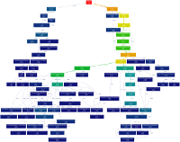

# TorqueProfTool
TorqueProfTool is a python program which can be used to convert the profiler output from the Torque3D engine into a json format call graph which can be visualized using tools such as gprof2dot and graphviz.

## Example
The following call-graph was generated from the profiler dump of the [Pacific demo scene](http://torque3d.wdfiles.com/local--files/communityproject%3Aperformance%3Aprofiling-and-optimisation/profilerDumpToFile241587.txt) from [Torque3D.org](http://torque3d.org), and shows all functions which consumed at least 0.1% of the cpu time.  
TorqueProfTool was used to convert the profiler dump into a json format call graph, then [gprof2dot](https://github.com/jrfonseca/gprof2dot) was used to convert the callgraph to dot graph.  
Finaly, a png image was generated using [graphviz](http://www.graphviz.org).  
[](examples/pacific_full.png?raw=true)  
  
  
## Requirements
[Python](http://www.python.org) (Tested with python 2.7.6)
  
### Optional
[gprof2dot](https://github.com/jrfonseca/gprof2dot) for conversion to other graph formats.  
[GraphViz](http://www.graphviz.org) to visualize the call graph.  
[xdot](https://github.com/jrfonseca/xdot.py) for interactive visualization (requires [PyGTK](http://www.pygtk.org))  
  
  
## Usage
```
torqueProfTool.py [options] [file] ...

Options:
  -h, --help                                    show the help message and exit
  -r ROOT_FUNC, --root=ROOT_FUNC                Name of function to use as the root node
  -o OUT_FILENAME, --output-file=OUT_FILENAME   Name of file to write output to
```

