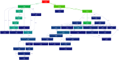
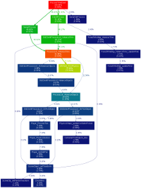

# TorqueProfTool
TorqueProfTool can be used to convert the profiler output from the Torque3D engine into a json format call graph which can be visualized using tools such as gprof2dot and graphviz.

## Example
This call-graph was generated from the profiler dump of the [Pacific demo scene](http://torque3d.wdfiles.com/local--files/communityproject%3Aperformance%3Aprofiling-and-optimisation/profilerDumpToFile241587.txt) from [Torque3D.org](http://torque3d.org).  
Two main branches are visible: the simulation branch, rooted at ProcessTimeEvent (~15% of the processor time), and the rendering branch, rooted at CanvasRenderControls (~85% of processor time).  
  

Examining the rendering branch in more detail by rooting the call graph at Scene_renderObjects, it can be seen that a large proportion of the processor time was spent in the subroutines responsible for forest rendering.  
  

Examining the simulation branch in more detail by routing the call graph at ProcessTimeEvent, the Bullet physics were consuming almost 3/4 of the available simulation time.  
  

